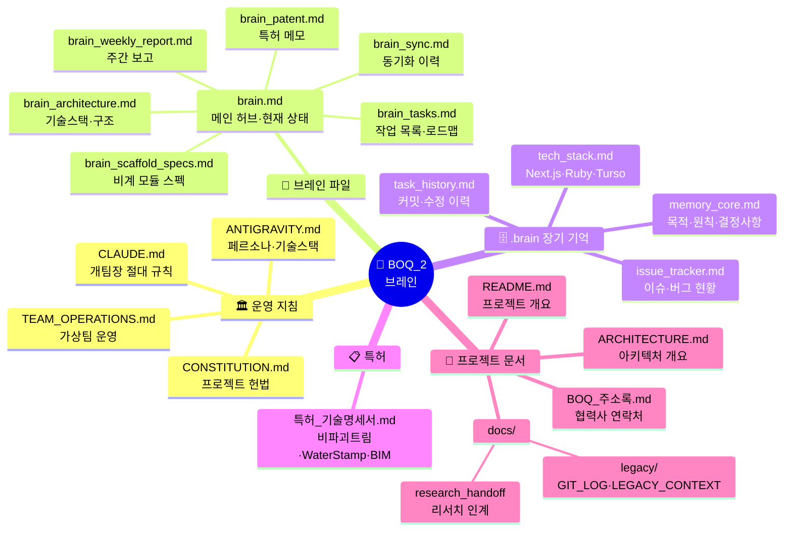

# BOQ_docs_brain_map

> 출처: `BOQ_2/docs/brain_map.md` — 1지국 BOQ (정도전) 자동 흡수
> 흡수일: 2026-05-09

# BOQ_2 브레인 파일 관계도

```mermaid
mindmap
  root((🧠 BOQ_2<br/>브레인))
    🏛️ 운영 지침
      CLAUDE.md<br/>개팀장 절대 규칙
      ANTIGRAVITY.md<br/>페르소나·기술스택
      CONSTITUTION.md<br/>프로젝트 헌법
      TEAM_OPERATIONS.md<br/>가상팀 운영
    🧠 브레인 파일
      brain.md<br/>메인 허브·현재 상태
        brain_tasks.md<br/>작업 목록·로드맵
        brain_architecture.md<br/>기술스택·구조
        brain_sync.md<br/>동기화 이력
        brain_weekly_report.md<br/>주간 보고
        brain_scaffold_specs.md<br/>비계 모듈 스펙
        brain_patent.md<br/>특허 메모
    🗄️ .brain 장기 기억
      memory_core.md<br/>목적·원칙·결정사항
      tech_stack.md<br/>Next.js·Ruby·Turso
      task_history.md<br/>커밋·수정 이력
      issue_tracker.md<br/>이슈·버그 현황
    📋 특허
      특허_기술명세서.md<br/>비파괴트림·WaterStamp·BIM
    📖 프로젝트 문서
      README.md<br/>프로젝트 개요
      ARCHITECTURE.md<br/>아키텍처 개요
      BOQ_주소록.md<br/>협력사 연락처
      docs/
        research_handoff<br/>리서치 인계
        legacy/<br/>GIT_LOG·LEGACY_CONTEXT
```

## 연결
- [[홍익인간]]
- [[신고조선_제국_전체_구조]]
- [[3지국장_정체성]]

## 연결

- [[홍익인간]]