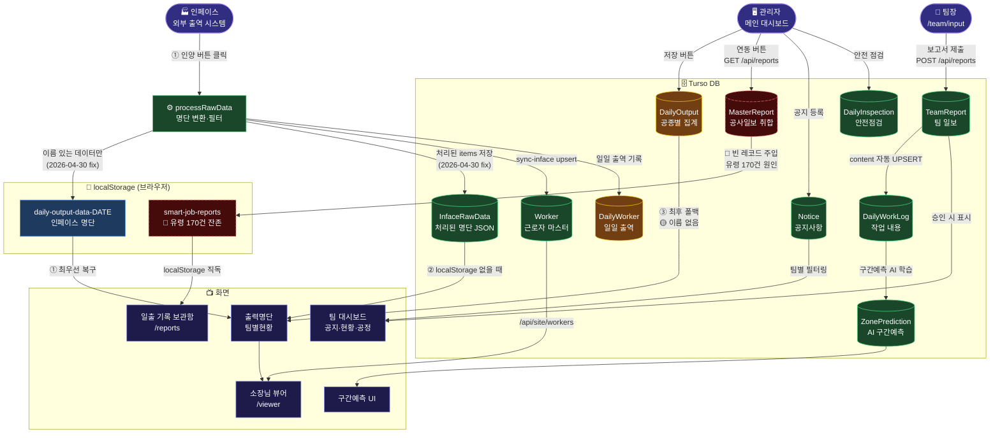
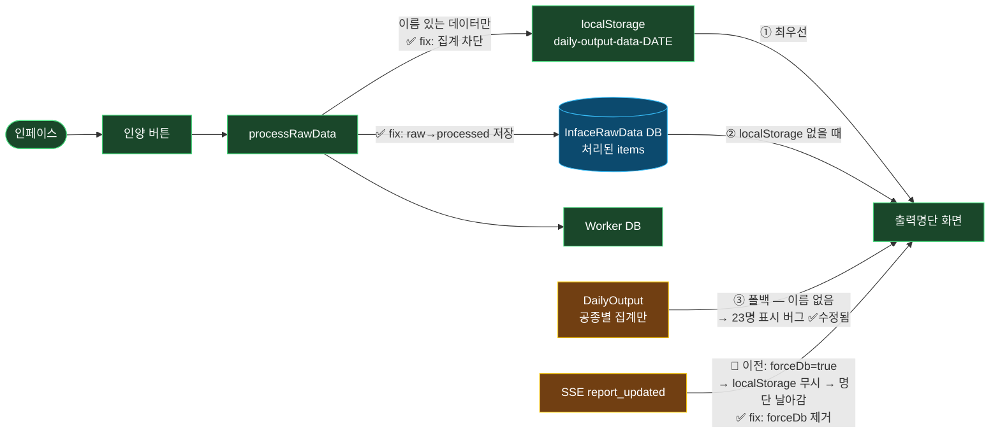

# H2OWIND_DATA_FLOW

> 출처: `H2OWIND_2/DATA_FLOW.md` — 2지국 H2OWIND (이순신) 자동 흡수
> 흡수일: 2026-05-09

# H2OWIND 데이터 흐름 맵
> 2026-04-30 기준 · 이순신(H2OWIND 지국) 작성
> 🟢 정상 · 🟡 주의 · 🔴 단절/심각 · ⬛ 사실상 미사용

---

## 전체 흐름 개요



---

## 흐름별 상세 진단

### 🏭 인페이스 → 출력명단



**과거 문제**: 팀장이 보고서 제출 → SSE 이벤트 → forceDb=true → localStorage 무시 → DB fallback → 이름 없는 집계 데이터 → 명단 휘발
**현재 상태**: 3중 fix 완료. 인양 1회 후 영구 유지.

---

### 👷 팀장 보고 → 대시보드

```mermaid
flowchart LR
    classDef ok   fill:#1a472a,stroke:#4

... (잘림 — 원본: `/home/nas/H2OWIND_2/DATA_FLOW.md`)

## 연결
- [[홍익인간]]
- [[신고조선_제국_전체_구조]]
- [[3지국장_정체성]]


## 연결

- [[홍익인간]]
